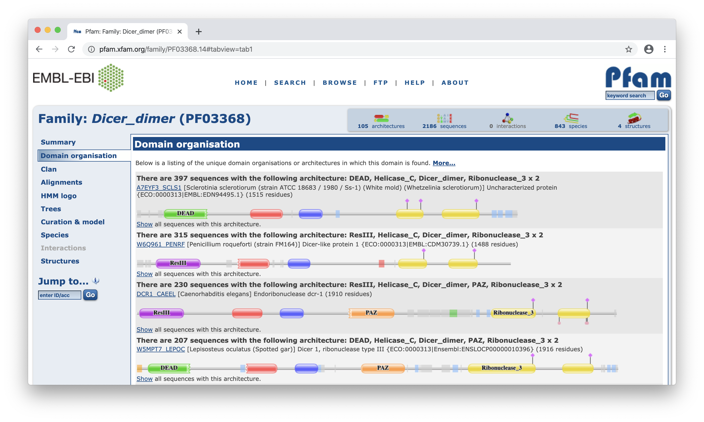
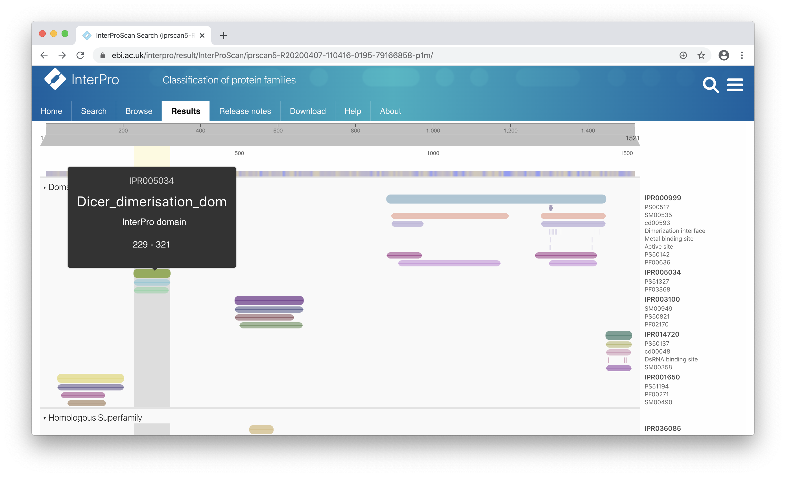
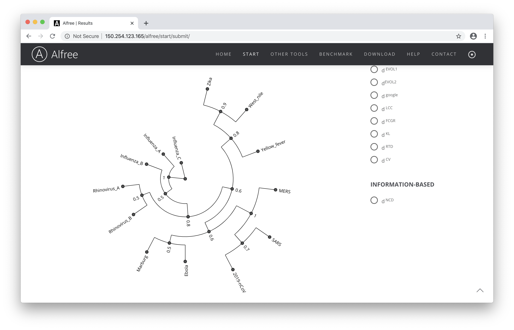

## Domeny białkowe

### Zad. 1 - Serwis Pfam (modele HMM)
> **Pfam** jest bazą przyrównań domen białkowych otrzymanych z sekwencji bazy UniProt. Każda domena jest przedstawiona za pomocą ukrytego modelu Markowa (HMM) utworzonego z przyrównania (*seed alignment*) konserwatywnych oraz reprezentatywnych sekwencji danej rodziny białkowej. W związku z tym, że sposób oceniania prawdopodobieństw w przypadku HMM jest bardziej złożony niż w przypdaku metod opartych na profilach, ich wykorzystanie zwiększa czułość dopasowywania sekwencji do bazy danych. Baza Pfam składa się z dwóch części, **Pfam-A** oraz **Pfam-B**. Pierwsza zawiera przyrównania wysokiej jakości (tj. zweryfikowane przez pracowników Pfam), natomiast druga przechowuje przyrównania wygenerowane automatycznie (obejmuje ona więcej modeli, lecz potencjalnie zawiera też więcej błędów, ponieważ niektóre modele HMM generowane są z niespokrewnionych sekwencji).

> Obejrzyj wprowadzenie do bazy Pfam: [YouTube](https://youtu.be/unExXijjMmI) [8min].

Otwórz serwis [Pfam](https://pfam.xfam.org) i zidentyfikuj domeny białkowe obecne w poniższej sekwencji: 

```
>sequence
NNRNQDNYVSWSDSEDDDEDEEIEEKEKPETNFPSPFTNILCGIIFVERRYTAVVLNRLI
KEAGKQDPELAYISSNFITGHGIGKNQPRNKQMEAEFRKQEEVLRKFRAHETNLLIATSI
VEEGVDIPKCNLVVRFDLPTEYRSYVQSKGRARAPISNYIMLADTDKIKSFEEDLKTYKA
IEKILRNKCSKSVDTGETDIDPVMDDDDVFPPYVLRPDDGGPRVTINTAIGHINRYCARL
PSDPFTHLAPKCRTRELPDGTFYSTLYLPINSPLRASIVGPPMSCVRLAERVVALICCEK
LHKIGELDDHLMPVGKETVKYEEELDLHDEEETSVPGRPGSTKRRQCYPKAIPECLRDSY
PRPDQPCYLYVIGMVLTTPLPDELNFRRRKLYPPEDTTRCFGILTAKPIPQIPHFPVYTR
SGEVTISIELKKSGFMLSLQMLELITRLHQYIFSHILRLEKPALEFKPTDADSAYCVLPL
NVVNDSSTLDIDFKFMEDIEKSEARIGIPSTKYTKETPFVFKLEDYQDAVIIPRYRNFDQ
PHRFYVADVYTDLTPLSKFPSPEYETFAEYYKTKYNLDLTNLNQPLLDVDHTSSRLNLLT
PRHLNQKGKALPLSSAEKRKAKWESLQNKQILVPELCAIHPIPASLWRKAVCLPSILYRL
HCLLTAEELRAQTASDAGVGVRSLPADFRYPNLDFGWKKSIDSKSFISISNSSSAENDNY
CKHSTIVPENAAHQGANRTSSLENHDQMSVNCRTLLSESPGKLHVEVSADLTAINGLSYN
QNLANGSYDLANRDFCQGNQLNYYKQEIPVQPTTSYSIQNLYSYENQPQPSDECTLLSNK
YLDGNANKSTSDGSPVMAVMPGTTDTIQVLKGRMDSEQSPSIGYSSRTLGPNPGLILQAL
TLSNASDGFNLERLEMLGDSFLKHAITTYLFCTYPDAHEGRLSYMRSKKVSNCNLYRLGK
KKGLPSRMVVSIFDPPVNWLPPGYVVNQDKSNTDKWEKDEMTKDCMLANGKLDEDYEEED
EEEESLMWRAPKEEADYEDDFLEYDQEHIRFIDNMLMGSGAFVKKISLSPFSTTDSAYEW
KMPKKSSLGSMPFSSDFEDFDYSSWDAMCYLDPSKAVEEDDFVVGFWNPSEENCGVDTGK
QSISYDLHTEQCIADKSIADCVEALLGCYLTSCGERAAQLFLCSLGLKVLPVIKRTDREK
ALCPTRENFNSQQKNLSVSCAAASVASSRSSVLKDSEYGCLKIPPRCMFDHPDADKTLNH
LISGFENFEKKINYRFKNKAYLLQAFTHASYHYNTITDCYQRLEFLGDAILDYLITKHLY
EDPRQHSPGVLTDLRSALVNNTIFASLAVKYDYHKYFKAVSPELFHVIDDFVQFQLEKNE
MQGMDSELRRSEEDEEKEEDIEVPKAMGDIFESLAGAIYMDSGMSLETVWQVYYPMMRPL
IEKFSANVPRSPVRELLEMEPETAKFSPAERTYDGKVRVTVEVVGKGKFKGVGRSYRIAK
SAAARRALRSLKANQPQVPNS
```


1. Ile w sumie domen i rodzin domen zostało zidentyfikowanych w analizowanej sekwencji?
2. W jakiej pozycji w sekwencji znajduje się domena `Dicer_dimer`?
   > Serwis Pfam przedstawia dwa typy koordynatów `start` i `end`. Pozycje start i end w kolumnie **Alignment** oznaczają region przyrównania sekwencji zapytania z modelem HMM (*Hidden Markov Model*) reprezentującym domenę. Z kolei, koordynaty **Envelope** wyznaczają region w sekwencji, który został dodatkowo probabilistycznie wyznaczony jako miejsce występowania domeny. Region **Envelope** jest zwykle kilka aminokwasów dłuższy niż region **Alignment** i wyznacza on prawdopodobne miejsce występowania domeny.
3. Podaj wartość `E-value` przyrównania domeny `Dicer_dimer` z modelem HMM.

Rozwiń dopasowanie domeny `Dicer_dimer` z modelem HMM z bazy Pfam (`Show`).

4. Podaj nieprzerwany fragment sekwencji domeny o największym prawdopodobieństwie (zgodności) z modelem HMM.


#### Rekord domeny Dicer

Otwórz stronę rekordu domeny `Dicer_dimer`.

5. Podaj numer dostępu tej domeny w bazie Pfam.
6. Jaką funkcję pełni ta domena (krótko)?
7. Ile gatunków posiada tę domenę białkową?

Otwórz zakładkę `Species`.

8. Czy domena występuje u organizmów prokariotycznych?
9. W ilu gatunkach owadów występuje ta domena?


Będąc w zakladce `Species`, kliknij na kartę `Tree`.

10. Ile sekwencji białek człowieka posiada tę domenę?
11. Ile sekwencji białek człowiekowatych (*Hominidae*) posiada tę domenę. 
    * Podaj numery dostępu tych białek.

Otwórz zakładkę `HMM logo`.

12. Ile wynosi długość sekwencji domeny `Dicer_dimer`?
13. Jakie dwa aminokwasy są najbardziej zachowane w ósmej pozycji sekwencji domeny?

Przejdź do zakładki `Domain organization`.



14. Podaj najczęściej występujący układ domen w białkach, w którym występuje domena `Dicer_domain`.

Użyj sekwencji zapytania (`sequence`) w programie BLAST i przeszukaj bazę `RefSeq`.

15. Podaj numer dostępu i nazwa organizmu, z jakiego pochodzi sekwencja zapytania.
16. Jaką funkcję pełni to białko? 
    > Wskazówka: sekcja `COMMENT` rekordu w formacie GenBank.

<br>

### Zad. 2 - Serwis PROSITE (wzorce i profile sekwencyjne)
> **PROSITE** charakteryzuje funkcję białka oraz jego rodziny stosując jeden wzorzec konsensusowy. Wzorce sekwencji konsensusowe pochodzą z konserwatywnych regionów przyrównań sekwencji białkowych i  przedstawiane są w bazie PROSITE za pomocą wyrażeń regularnych. Informacje na temat funkcji tych wzorców pochodzą przede wszystkim z danych literaturowych. W celu przeszukania bazy badaną sekwencją PROSITE stosuje dokładne skojarzenie z wzorcem. Poza wyrażeniami regularnymi, w celu ich dopełnienia, serwis PROSITE tworzy także profile.


Użyj sekwencji z zad. 1 i serwisu [PROSITE](https://prosite.expasy.org/prosite.html) w celu identyfikacji domen białkowych. Umieść sekwencję w polu `Quick Scan mode of ScanProsite`. Naciśnij przycisk `Scan`.


1. Podaj nazwę domeny, której nie zidentyfikowano wcześniej w serwisie Pfam.
   * Jaką funkcję pełni ta domena?
2. Czy serwis PROSITE zidentyfikował jakieś wzorce sekwencyjne w sekwencji zapytania (`hits by patterns`)?
3. Podaj numer dostępu domeny *Dicer* w bazie PROSITE.
4. Czy lokalizacja domeny *Dicer* w sekwencji jest taka sama, jak w przewidywaniach Pfam?

#### Rekord domeny Dicer

Wejdź w rekord domeny Dicer w bazie PROSITE.

5. Podaj długość profilu domeny Dicer w bazie PROSITE (`Retrieve the sequence logo from the alignment`).
6. Czy w logo domeny Dicer aminokwasy `Y` i `F` są najbardziej zachowanymi aminokwasami?
7. Wejdź w `Taxonomic distribution` domeny *Dicer*.
   * Czy domena występuje u organizmów prokariotycznych?
<br><br>

### Zad. 3 - Metaserwis InterPro (integracja wyników)
> **InterPro** jest zintegrowaną bazą domen zaprojektowaną w celu ujednolicenia wielu baz domen i miejsc funkcjonalnych białek. InterPro łączy informacje z ponad 10 baz danych takich jak: PROSITE, Pfam. Program przetwarza wzorce sekwencji z tych baz danych. Uwzględnia jedynie te motywy oraz domeny sekwencji białkowych, które pokrywają się w kilku bazach. InterPro dopasowuje rekordy, wykorzystując kombinację wyrażeń regularnych, profili oraz ukrytych modeli Markowa. InterPro prezentuje wyniki w postaci graficznej, która podsumowuje dopasowania motywów oraz zawiera linki przekierowujące użytkownika do bardziej szczegółowych informacji na temat zidentyfikowanych domen.

> Zapoznaj się z podstawowymi wiadomościami na temat bazy InterPro: [InterPro: Quick tour](https://www.ebi.ac.uk/training/online/course/interpro-quick-tour/what-interpro).

Użyj sekwencji z zad. 1 i serwisu [InterPro](http://www.ebi.ac.uk/interpro/) w celu identyfikacji domen białkowych.



1. Ile domen białkowych zidentyfikowano?
2. Podaj numer dostępu domeny typu Dicer.
3. Podaj lokalizacaję domeny Dicer w sekwencji.
4. W oparciu o jakie bazy danych domen białkowych, domena Dicer została zidentyfikowana?

#### Rekord domemy Dicer
Otwórz zakładkę `Entries`.


Otwórz stronę rekordu domeny *Dicer* w bazie InterPro (`IPR005034`).

5. W ilu sekwencjach białkowych domena Dicer jest dostępna (zakładka `Proteins`)?
6. Ile z tych białek należy do *Eukaryota* i *Prokaryota*?
   * Zakładka: `Taxonomy` > `View your results as a tree`.
7. Ile jest różnych układów domen (`Domain architectures`), w których występuje domena Dicer?
8. Wymień szlaki biochemiczne (`Pathways`), w które zaangażowana jest domena Dicer.
<br><br>

### Zad. 4 - Informacje o domenach w rekordach UniProt
Użyj programu BLAST na stronie serwisu [UniProt](https://www.uniprot.org/) w celu zidentyfikowania sekwencji białkowej z zadania 1.

1. Podaj numer dostępu oraz nazwę znalezionej sekwencji.

Otwórz rekord znalezionej sekwencji białkowej.

2. Czy w rekordzie UniProt zawarte są informacje o domenach występujących w tym białku?
<br/><br/>


### Zad. 5 - InterPro: hierarchiczne relacje między domenami
Korzystając z serwisu InterPro zidentyfikuj domeny białkowe w poniższej sekwencji:

```
>seq1
MELRVLLCWASLAAALEETLLNTKLETADLKWVTFPQVDGQWEELSGLDEEQHSVRTYEV
CDVQRAPGQAHWLRTGWVPRRGAVHVYATLRFTMLECLSLPRAGRSCKETFTVFYYESDA
DTATALTPAWMENPYIKVDTVAAEHLTRKRPGAEATGKVNVKTLRLGPLSKAGFYLAFQD
QGACMALLSLHLFYKKCAQLTVNLTRFPETVPRELVVPVAGSCVVDAVPAPGPSPSLYCR
EDGQWAEQPVTGCSCAPGFEAAEGNTKCRACAQGTFKPLSGEGSCQPCPANSHSNTIGSA
VCQCRVGYFRARTDPRGAPCTTPPSAPRSVVSRLNGSSLHLEWSAPLESGGREDLTYALR
CRECRPGGSCAPCGGDLTFDPGPRDLVEPWVVVRGLRPDFTYTFEVTALNGVSSLATGPV
PFEPVNVTTDREVPPAVSDIRVTRSSPSSLSLAWAVPRAPSGAVLDYEVKYHEKGAEGPS
SVRFLKTSENRAELRGLKRGASYLVQVRARSEAGYGPFGQEHHSQTQLDESEGWREQLAL
IAGTAVVGVVLVLVVIVVAVLCLRKQSNGREAEYSDKHGQYLIGHGTKVYIDPFTYEDPN
EAVREFAKEIDVSYVKIEEVIGAGEFGEVCRGRLKAPGKKESCVAIKTLKGGYTERQRRE
FLSEASIMGQFEHPNIIRLEGVVTNSMPVMILTEFMENGALDSFLRLNDGQFTVIQLVGM
LRGIASGMRYLAEMSYVHRDLAARNILVNSNLVCKVSDFGLSRFLEENSSDPTYTSSLGG
KIPIRWTAPEAIAFRKFTSASDAWSYGIVMWEVMSFGERPYWDMSNQDVINAIEQDYRLP
PPPDCPTSLHQLMLDCWQKDRNARPRFPQVVSALDKMIRNPASLKIVARENGGASHPLLD
QRQPHYSAFGSVGEWLRAIKMGRYEESFAAAGFGSFELVSQISAEDLLRIGVTLAGHQKK
ILASVQHMKSQAKPGTPGGTGGPAPQY
```

1. Do jakiej rodziny białkowej zostało zaklasyfikowane to białko (`Protein family membership`)?
2. Ile domen białkowych zostało zidentyfikowanych w sekwencji zapytania?
3. Podaj lokalizację domeny kinazowej `Protein kinase domain (IPR000719)`.
4. Czy domena kinazowa zawiera miejsce wiązanie ATP (`Protein_kinase_ATP_BS`) i centrum aktywne (`Tyr_kinase_AS`)?

#### Rekord domeny kinazowej

Wejdź do rekordu domeny kinazowej `IPR000719`.


5. Wymień bazy domen, na podstawie których tworzony jest ten rekord w bazie InterPro (`Contributing Member Database Entries`).
6. Czy w obrębie domeny kinazowej można wyróżnić bardziej specyficzne domeny kinazowe? (`Domain relationships`)
7. Podaj nazwę nadrodziny, w skład której wchodzi domena kinazowa.
<br/><br/>


### Zad. 6 - InterPro: mutacja w obrębie domeny
Poniżej znajduje się sekwencja białkowa `seq2` odpowiadająca sekwencji `seq1` z poprzedniego zadania, lecz pochodzi od pacjenta chorującego na pewne schorzenie.

```
>seq2
MELRVLLCWASLAAALEETLLNTKLETADLKWVTFPQVDGQWEELSGLDEEQHSVRTYEV
CDVQRAPGQAHWLRTGWVPRRGAVHVYATLRFTMLECLSLPRAGRSCKETFTVFYYESDA
DTATALTPAWMENPYIKVDTVAAEHLTRKRPGAEATGKVNVKTLRLGPLSKAGFYLAFQD
QGACMALLSLHLFYKKCAQLTVNLTRFPETVPRELVVPVAGSCVVDAVPAPGPSPSLYCR
EDGQWAEQPVTGCSCAPGFEAAEGNTKCRACAQGTFKPLSGEGSCQPCPANSHSNTIGSA
VCQCRVGYFRARTDPRGAPCTTPPSAPRSVVSRLNGSSLHLEWSAPLESGGREDLTYALR
CRECRPGGSCAPCGGDLTFDPGPRDLVEPWVVVRGLRPDFTYTFEVTALNGVSSLATGPV
PFEPVNVTTDREVPPAVSDIRVTRSSPSSLSLAWAVPRAPSGAVLDYEVKYHEKGAEGPS
SVRFLKTSENRAELRGLKRGASYLVQVRARSEAGYGPFGQEHHSQTQLDESEGWREQLAL
IAGTAVVGVVLVLVVIVVAVLCLRKQSNGREAEYSDKHGQYLIGHGTKVYIDPFTYEDPN
EAVREFAKEIDVSYVKIEEVIGAGEFGEVCRGRLKAPGKKESCVAISTLKGGYTERQRRE
FLSEASIMGQFEHPNIIRLEGVVTNSMPVMILTEFMENGALDSFLRLNDGQFTVIQLVGM
LRGIASGMRYLAEMSYVHRDLAARNILVNSNLVCKVSDFGLSRFLEENSSDPTYTSSLGG
KIPIRWTAPEAIAFRKFTSASDAWSYGIVMWEVMSFGERPYWDMSNQDVINAIEQDYRLP
PPPDCPTSLHQLMLDCWQKDRNARPRFPQVVSALDKMIRNPASLKIVARENGGASHPLLD
QRQPHYSAFGSVGEWLRAIKMGRYEESFAAAGFGSFELVSQISAEDLLRIGVTLAGHQKK
ILASVQHMKSQAKPGTPGGTGGPAPQY
```

Wykorzystaj narzędzie poznane na wcześniejszych zajęciach i przeprowadź globalne przyrównanie obu sekwencji. 

1. Jakie zmiany w sekwencji tego białka występują u chorego pacjenta?

Przeanalizuj białko pacjenta przy użyciu serwisu InterPro i porównaj z wynikami dla sekwencji osoby zdrowej. 

2. W obrębie, której domeny doszło do mutacji u pacjenta?
<br/><br/>

### Zad. 7 - InterPro: wszystkie białka zawierające domenę RRM
Otwórz stronę serwisu [InterPro](https://www.ebi.ac.uk/interpro/). W polu szybkiego wyszukiwania (`Search by text`) wyszukaj domenę RRM `RNA recognition motif domain` (`IPR000504`). Podaj liczbę białek zawierających domenę RRM u bakterii.
<br/><br/>

### Zad. 8 - UniProt: wszystkie białka zawierające domenę RRM
W bazie UniProt skorzystaj z zaawansowanego wyszukiwania (`Advanced`) i wyszukaj wszystkie białka zawierające domenę RRM u bakterii (`Cross-reference` > `Family and domain databases` > `InterPro`, `Taxonomy` > `Bacteria`)

1. Podaj użyte zapytanie do bazy UniProt.
2. Ile białek otrzymano?

<br>

## Ontologia genów
> Obejrzyj wprowadzenie do ontologii genów i serwisu QuickGO: [YouTube](https://youtu.be/_QRgN0yLPn0) [37min].


### Zad. 9 - Ontologia pojedynczego genu
W bazie `Gene` serwisu NCBI wyszukaj gen człowieka o nazwie *CASP6*.

1. Podaj pełną nazwę tego genu.
2. W oparciu o informacje zaware w panelu `General gene information` wymień dwa przykładowe opisy dla każdego z trzech działów ontologicznych:
   * funkcji komórkowej
   * procesu biologicznego
   * komponentu komórkowego
3. O czym informują trzyliterowe kody znajdujące się w kolumnie `Evidence Code`?
4. Na stronie rekordu odszukaj identyfikator bazy UniProt kodowanego przez ten gen białka i przejdź do rekordu UniProt. Czy w rekordzie UniProt również znajdują się informacje na temat ontologii tego genu?

<br>

### Zad. 10 - Wyszukiwanie genów zaangażowanych w dany proces biologicznych
> Celem tego zadania jest wyszukanie wszystkich genów człowieka (nie tylko *CASP6*) zaangażowanych w proces zaprogramowanej śmierci komórki (*programmed cell death*, PCD).

W serwisie [QuickGO](https://www.ebi.ac.uk/QuickGO/), w polu wyszukiwania (`Quick search`) wpisz frazę `programmed cell death` i z listy autouzupełnień wybierz rekord odpowiadający temu procesowi.

1. Podaj numer dostępu procesu PCD.
2. Jak przebiega proces PCD (jednym zdaniem)?
3. Przejdź do zakładki `Child Terms`. Czy PCD jest tym samym, czym apoptoza?
4. Wymień 3 procesy wchodzące w skład PCD.

Naciśnij niebieski przycisk `annotations`. 


5. Ile jest genów/białek, które biorą udział w PCD?
6. Skorzystaj z filtrów (`Gene Products`) i ogranicz liczbę wyników do białek. 
   - Ile rekordów znaleziono?
7. Ogranicz listę wyników otrzymaną w pkt. 6 do białek, których funkcja PCD została przypisana na podstawie doświadczeń laboratoryjnych (`experimental evidence used in manual assertion`).
   - Ile rekordów znaleziono?
8. Ogranicz listę wyników otrzymaną w pkt. 7 do białek należących do człowieka (`Taxon` > Identyfikator taksonomiczny człowieka: `9606`)
   - Ile rekordów znaleziono
9. Z listy wyników wybierz dowolne białko i przejdź do rekordu w bazie UniProt. Jaki jest numer dostępu tego białka?
10. W opraciu o informajce zawarte w rekordzie UniProt odpowiedz, czy białko bierze udział w procesach biologicznych innych niż PCD?

<br>

## Metody alignment-free

> Przeczytaj [artykuł przeglądowy](https://genomebiology.biomedcentral.com/articles/10.1186/s13059-017-1319-7) na temat metody porównywania sekwencji typu "alignment-free".


### Zad. 11 - Relacje filogenetyczne koronawirusów
Poniżej znajduje się lista numerów dostępu sekwencji genomowych 13 wirusów, w tym koronawirusów: 2019-nCoV z Wuhan (GenBank: `MN908947`, chińska nazwa: 2019新型冠狀病毒), SARS i MERS.

| GenBankID | Common Name | Family |
| --- | --- | --- |
| JF915184 | Influenza A H1N1 | Orthomyxoviridae |
| KX169266 | Influenza B | Orthomyxoviridae |
| JX947861 | Influenza C | Orthomyxoviridae |
| NC002549 | Ebola   | Filoviridae |
| KR063674 | Marburg | Filoviridae |
| KT029139 | MERS    | Coronaviridae |
| NC004718 | SARS    | Coronaviridae |
| MN908947 | 2019-nCoV   | Coronaviridae |
| NC001563 | West Nile   | Flaviviridae |
| NC002031 | Yellow Fever    | Flaviviridae |
| NC012532 | Zika    | Flaviviridae |
| NC001617 | Rhinovirus A    | Picornaviridae |
| NC038312 | Rhinovirus B    | Picornaviridae |

Wejdź na stronę [NCBI](https://www.ncbi.nlm.nih.gov), wybierz nukleotydową bazę danych i w oknie wyszukiwania wklej poniższe numery dostępu sekwencji wirusowych. Pobierz sekwencje w formacie FASTA.

```
JF915184
KX169266
JX947861
NC002549
KR063674
KT029139
NC004718
MN908947
NC001563
NC002031
NC012532
NC001617
NC038312
```

Otwórz serwis [Alfree](http://www.combio.pl/alfree). Naciśnij przycisk `START`, umieść wszystkie sekwencje w polu tekstowym `Sequence (FASTA format`). W panelu `Advanced options` ustaw dlugość słowa: 5. Naciśnij przycisk `Submit`.



1. Czy sekwencje wirusowe grupują się ze względu na przynależność do rodziny?
2. Z którym wirusem, wirus 2019-nCoV jest najbliżej spokrewniony?
<br><br>

### Zad. 12 - Programowanie (dla chętnych)
Utwórz skrypt, który dla sekwencji wirusowych z poprzedniego zadania obliczy *Normalized Compression Distance (NCD)* [rys. 2 w artykule] między każdą parą sekwencji w pliku. Jako formę kompresji do obliczania NCD użyj metodę Lempel-Ziv.

Przykład kompresji Lempel-Ziv dla poniższej sekwencji `x`:

```
AABABBBABAABABBBABBABB
```

Rozpoczynamy czytanie sekwencji z lewej strony. Znajdujemy najkrótszą podsekwencję, której nie spotkaliśmy wcześniej. To zawsze będzie pojedyncza litera, w tym przypadku `A`:

```
A|ABABBBABAABABBBABBABB
```

Następnie wybieramy kolejną podsekwencję, której nie widzieliśmy. Ponieważ widzieliśmy już `A`, wybieramy `AB`:

```
A|AB|ABBBABAABABBBABBABB
```

Następną podsekwencją, której nie widzieliśmy jest `ABB`, ponieważ widzieliśmy już `AB`.

```
A|AB|ABB|BABAABABBBABBABB
```

Kontynuując, następną podsekwencją będzie pojedyncza litera `B`. Otrzymujemy:

```
A|AB|ABB|B|ABAABABBBABBABB
```

Dalsza część sekwencji zostanie podzielona w poniższy sposób:

```
A|AB|ABB|B|ABA|ABAB|BB|ABBA|BB
```

Ponieważ nie ma więcej liter w sekwencji wejściowej, podsekwencja `BB` zostaje powtórzona.

Złożoność Lempel-Ziv jest liczbą przedziałów, które wyznaczyliśmy.

```
c(x) = 9
```